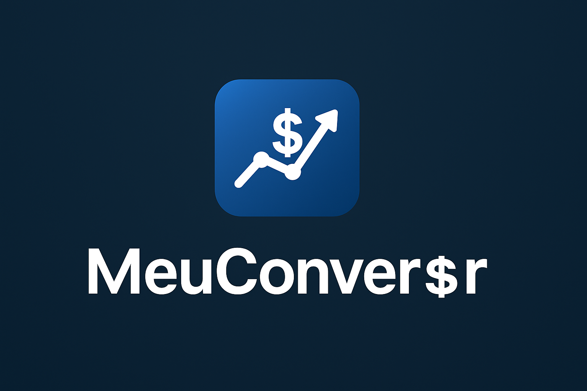

# MeuConvers$r

## 📋 Introdução

Esse é o repositório do projeto MeuConvers$r. Essa aplicação é direcionada para dois públicos: pessoas que viajam com frequência e aqueles que realizam investimentos. Essas duas personas vão utilizar o aplicativo com o objetivo de realizar conversão para a sua moeda que utiliza com maior frequência.

## ✨ Funcionalidades

- [ ] Escolher uma moeda
- [ ] Dados precisos
- [ ] Ver o quanto essa moeda vale comparada a outra moeda
- [ ] Selecionar mais de uma moeda e comparar os valores
- [ ] Ter acesso a evolução dos valores históricos dessa moeda
- [ ] Modelo de machine learning pode sugerir o quanto a moeda vai valer no futuro 
- [ ] Indicações de onde comprar a moeda

